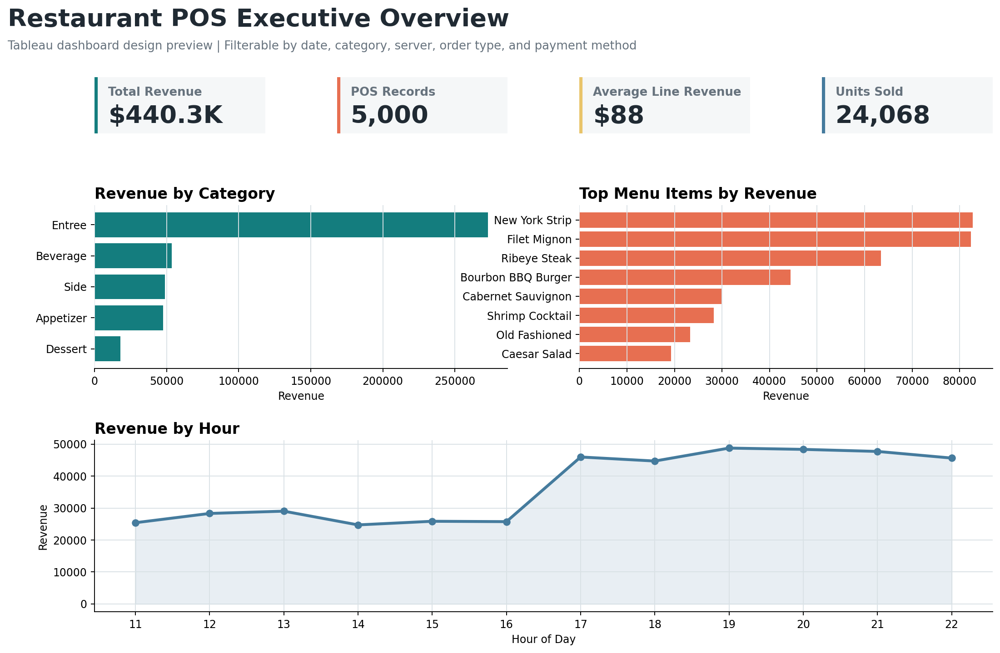
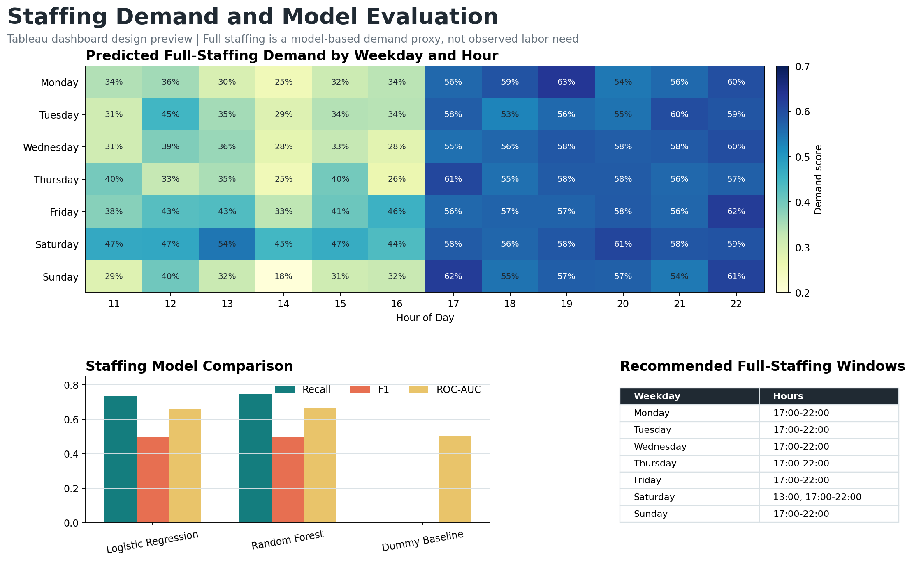
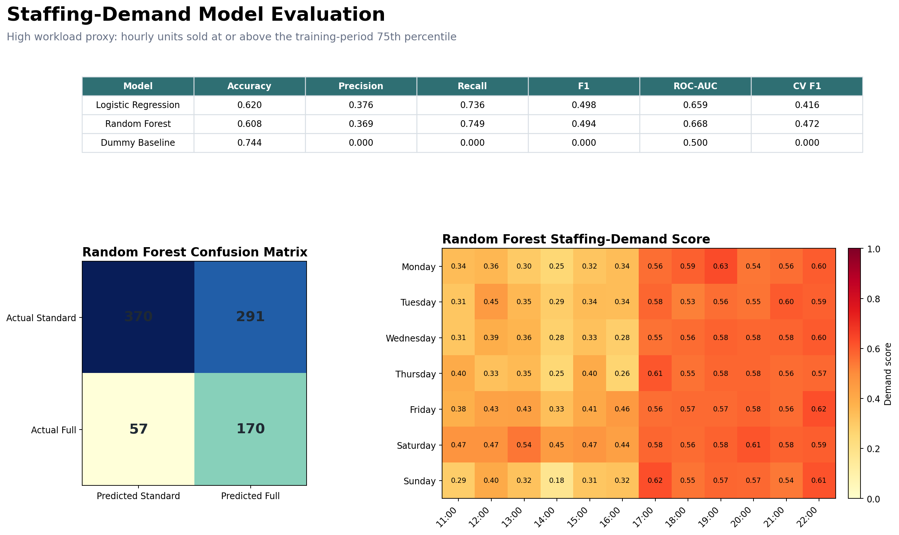

# Restaurant POS Sales Analytics

[GitHub Repository](https://github.com/antoguarr/RestaurantAnalytics)

**Project status: Complete** | Python analysis, SQL, machine learning, Streamlit dashboard, staffing model, Power BI data layer, and Tableau reporting layer are included in this repository.


## Project Overview

This project analyzes simulated point-of-sale records for a steakhouse restaurant. The goal is to identify revenue drivers, understand menu and server performance, uncover sales patterns by day and time, and run a classification experiment identifying characteristics associated with high-value POS records.

The analysis is designed as a business-facing data analytics project, combining exploratory data analysis, SQL, Streamlit, Tableau, Power BI preparation, machine learning evaluation, and actionable recommendations for restaurant management.

## Dashboard Screenshots

### Menu and Operations


### Model Evaluation


### Tableau Reporting Layer: Complete





The completed Tableau repository package includes:

- [Tableau-ready Excel workbook](tableau/data/restaurant_pos_tableau.xlsx) with POS records, staffing recommendations, model results, and a data dictionary
- [Tableau dashboard guide](tableau/README.md) covering the Executive Overview and Staffing and Models dashboards
- [Calculated fields](tableau/calculated_fields.md) for KPIs, comparisons, and staffing recommendations
- Reproducible CSV exports and Python generation scripts
- Tableau Public deployment instructions

Publishing to Tableau Public is optional and requires the repository owner's Tableau account. The local Tableau reporting deliverable is complete and version-controlled.

## Business Questions

This project investigates the following questions:

- Which menu categories and items generate the most revenue?
- Which days and hours produce the strongest sales?
- How does server performance compare across revenue and POS record volume?
- Are certain order types or payment methods associated with higher revenue?
- Which recorded characteristics are associated with high-revenue POS records?

## Dataset

The dataset contains 5,000 simulated restaurant POS records from 2024.

Each row represents one menu-item line recorded by the POS system and includes:

- Date and time recorded
- Menu item and category
- Quantity ordered
- Price per item
- Total revenue
- Payment method
- Order type
- Server ID and server name

The source does not include an order or receipt ID. Multiple line items therefore cannot be grouped into complete restaurant checks, so this project reports **POS record count** and **average line revenue** rather than transaction count or average order value.

Dataset file:

```text
Data/steakhouse_pos_simulated_data.csv
```

## Tools Used

- Python
- pandas
- matplotlib
- scikit-learn
- Jupyter Notebook
- Streamlit
- Plotly
- Power BI
- Tableau
- SQL

## Methodology

The project is organized so that reusable logic is separated from the notebook:

- `src/data_cleaning.py` loads the POS data, validates required columns, standardizes data types, and removes duplicate rows.
- `src/feature_engineering.py` creates calendar, hourly, weekend, and high-revenue target features.
- `src/model.py` builds and evaluates the machine learning pipeline.
- `src/staffing_model.py` aggregates hourly workload and evaluates schedule-time staffing models with chronological validation.
- `notebooks/eda.ipynb` uses those modules to run the analysis and present business insights.
- `app.py` turns the analysis into an interactive Streamlit dashboard for business exploration.
- `scripts/export_powerbi_data.py` exports a cleaned, feature-enriched dataset for Power BI.
- `scripts/export_tableau_data.py` exports POS, staffing, and model-comparison tables for Tableau.
- `scripts/create_tableau_previews.py` generates the Tableau dashboard design previews.
- `scripts/run_sql_analysis.py` runs SQL queries against the prepared dataset and exports result tables.
- `scripts/run_staffing_model.py` regenerates the staffing results tables and README figure.
- `scripts/create_readme_screenshots.py` generates dashboard screenshots for the README.
- `powerbi/` contains Power BI report instructions, suggested DAX measures, and the export-ready CSV.
- `tableau/` contains the Tableau-ready workbook, calculated fields, dashboard specification, screenshots, and reproducible source tables.
- `sql/` contains reusable SQL queries and exported SQL result tables.

## Key Findings

### 1. Entrees contribute the largest revenue share

Entrees generated **$272,974.90**, representing approximately **62.0%** of total revenue. This identifies entrees as the largest revenue contributor, but it does not establish profitability because product costs are unavailable.

### 2. Desserts may offer an upselling opportunity

Desserts represented approximately **4.0%** of revenue, or **$17,739.00**. Because desserts are lower-priced than entrees, this does not by itself prove poor performance; it suggests an opportunity to test dessert upselling, bundles, or server prompts.

### 3. Three premium steaks contribute over half of revenue

New York Strip, Filet Mignon, and Ribeye Steak generated a combined **$228,576.70**, accounting for approximately **51.9%** of total revenue. Their contribution reflects both sales volume and higher menu prices, so revenue alone should not be interpreted as margin or item popularity.

### 4. Saturday has the strongest average daily revenue

Saturday produced the highest average daily revenue at approximately **$1,421.85** per day. This was about **25% higher** than Thursday, the weakest day by average daily revenue.

### 5. Dinner hours outperform lunch hours

The strongest revenue hours were **7 PM, 8 PM, and 9 PM**, each generating roughly **$47,000-$49,000** in total revenue. Average line revenue during these peak dinner hours was approximately **$112**, compared with about **$66-$67** during early afternoon hours.

### 6. Server revenue is balanced, with Nina leading

Nina generated the highest total revenue at **$91,506.80**, representing approximately **20.8%** of total revenue. Overall server performance was relatively balanced, with the gap between the highest and lowest revenue-generating servers at about **$7,941.70**.

## Model Evaluation

This is a classification experiment identifying characteristics associated with high-value POS records. The target is whether a record's revenue is above the dataset median; it is not a forecast of customer spend or a prediction made before an item is selected.

Features used included:

- Menu item
- Category
- Payment method
- Order type
- Server name
- Weekday
- Hour
- Month
- Weekend indicator

Models were evaluated using a stratified 80/20 holdout split and five-fold stratified cross-validation. Random Forest performed best on holdout F1, while Logistic Regression produced similar cross-validation results with a simpler model:

| Model | Accuracy | F1 | ROC-AUC | CV F1 |
| --- | ---: | ---: | ---: | ---: |
| Random Forest | 0.792 | 0.786 | 0.889 | 0.775 |
| Logistic Regression | 0.773 | 0.763 | 0.881 | 0.768 |
| Dummy Baseline | 0.501 | 0.000 | 0.500 | 0.000 |

The notebook and dashboard expose this comparison directly, followed by the Random Forest confusion matrix, classification report, and feature importances.

Menu item is known only once a customer is ordering and indirectly carries price information. The model is therefore useful for describing patterns associated with higher-value POS records, not for forecasting customer demand or spend before an order begins.

## Staffing-Demand Model

The staffing model estimates when full staffing may be warranted using only information available when a schedule is created: hour, weekday, and cyclical month features. Because the source does not contain actual staffing levels or labor standards, **full staffing is a high-workload proxy**, defined as an open hour with at least **9 units sold**. This threshold is the 75th percentile calculated from the training period.

The pipeline aggregates the POS data into 4,392 date-hour slots, fills open hours with no recorded sales, trains on the first 80% of dates, and evaluates on the final 20% beginning October 19, 2024. Five-fold time-series cross-validation is applied only to the training period.

| Model | Accuracy | Precision | Recall | F1 | ROC-AUC | CV F1 |
| --- | ---: | ---: | ---: | ---: | ---: | ---: |
| Logistic Regression | 0.620 | 0.376 | 0.736 | 0.498 | 0.659 | 0.416 |
| Random Forest | 0.608 | 0.369 | 0.749 | 0.494 | 0.668 | 0.472 |
| Dummy Baseline | 0.744 | 0.000 | 0.000 | 0.000 | 0.500 | 0.000 |

The Dummy model's high accuracy comes from always predicting the majority class and missing every high-workload hour. The Random Forest is used for the staffing schedule because it has the strongest time-series CV F1 and holdout recall. It identifies **74.9%** of high-workload hours, but its **36.9% precision** means it also recommends full staffing for many standard-demand hours. This is appropriate only as a conservative planning signal, not an automated labor decision.

The model recommends full staffing most consistently from **5 PM through 10 PM** on every weekday, with an additional **Saturday 1 PM** signal.



Reproducible tables are available in `docs/model_outputs/staffing_model_results.csv` and `docs/model_outputs/staffing_schedule.csv`.

## SQL Analysis

The project includes a small SQL analysis component using SQLite. Queries are stored in:

```text
sql/restaurant_analysis.sql
```

The SQL analysis answers questions such as:

- Which menu categories generate the most revenue?
- Which menu items are the top revenue drivers?
- Which weekdays and hours perform best?
- Which servers generate the most revenue?
- Which servers have the highest dessert revenue share?

SQL outputs are exported to:

```text
sql/results/
```

## Business Recommendations

- Prioritize premium entree promotion, especially steak items that account for the majority of revenue.
- Test dessert upselling strategies and measure whether they increase dessert attachment and revenue.
- Use the staffing-demand model as a conservative planning signal for 5 PM through 10 PM, then adjust using reservations, events, weather, and manager knowledge.
- Use Saturday demand patterns to guide inventory planning and scheduling.
- Study top-performing server POS record patterns to form testable training hypotheses, without assuming revenue differences are caused by server behavior.
- Use the classifier as an analytical experiment for identifying high-value record patterns, not as a forecasting or staff-evaluation tool.

## Project Structure

```text
RestaurantAnalytics/
├── .streamlit/
│   └── config.toml
├── .gitignore
├── app.py
├── Data/
│   └── steakhouse_pos_simulated_data.csv
├── docs/
│   ├── model_outputs/
│   │   ├── staffing_model_results.csv
│   │   └── staffing_schedule.csv
│   └── screenshots/
│       ├── dashboard-live.png
│       ├── dashboard-menu-operations.png
│       ├── dashboard-model-evaluation.png
│       ├── dashboard-overview.png
│       └── staffing-model-evaluation.png
├── notebooks/
│   └── eda.ipynb
├── powerbi/
│   ├── README.md
│   ├── dax_measures.md
│   └── data/
│       └── restaurant_pos_powerbi.csv
├── tableau/
│   ├── README.md
│   ├── calculated_fields.md
│   ├── data/
│   │   ├── model_results.csv
│   │   ├── pos_records.csv
│   │   ├── restaurant_pos_tableau.xlsx
│   │   └── staffing_schedule.csv
│   └── screenshots/
│       ├── tableau-executive-overview.png
│       └── tableau-staffing-models.png
├── scripts/
│   ├── create_tableau_previews.py
│   ├── create_readme_screenshots.py
│   ├── export_powerbi_data.py
│   ├── export_tableau_data.py
│   ├── run_sql_analysis.py
│   └── run_staffing_model.py
├── sql/
│   ├── README.md
│   ├── restaurant_analysis.sql
│   └── results/
├── src/
│   ├── __init__.py
│   ├── data_cleaning.py
│   ├── feature_engineering.py
│   ├── model.py
│   └── staffing_model.py
├── tests/
│   └── test_staffing_model.py
├── README.md
└── requirements.txt
```

## How to Run

Clone the repository and install the required Python packages:

```bash
pip install -r requirements.txt
```

Open the notebook:

```bash
jupyter notebook notebooks/eda.ipynb
```

Run the notebook cells from top to bottom to reproduce the exploratory analysis, visualizations, and machine learning model.

To launch the interactive dashboard:

```bash
streamlit run app.py
```

The dashboard includes KPI cards, filters, category and menu item analysis, weekday and hourly revenue trends, server performance, order type analysis, revenue-model evaluation, a staffing-demand model, confusion matrices, feature importance, and business recommendations.

To rerun the staffing pipeline and regenerate its tables and README figure:

```bash
python scripts/run_staffing_model.py
```

To run the staffing pipeline tests:

```bash
python -m unittest tests/test_staffing_model.py
```

To run the SQL analysis:

```bash
python scripts/run_sql_analysis.py
```

To refresh the Power BI-ready CSV:

```bash
python scripts/export_powerbi_data.py
```

Then import this file into Power BI:

```text
powerbi/data/restaurant_pos_powerbi.csv
```

Power BI report setup instructions and DAX measures are available in the `powerbi/` folder.

To refresh the Tableau-ready sources and dashboard previews:

```bash
python scripts/export_tableau_data.py
python scripts/create_tableau_previews.py
```

Import the prepared workbook into Tableau:

```text
tableau/data/restaurant_pos_tableau.xlsx
```

The complete Tableau build and Tableau Public publishing instructions are in `tableau/README.md`.

To regenerate README screenshots:

```bash
python scripts/create_readme_screenshots.py
```

## Deployment

The Streamlit dashboard is ready to deploy from GitHub using `app.py` as the main file and `requirements.txt` for dependencies.

Recommended Streamlit Community Cloud settings:

```text
Repository: antoguarr/RestaurantAnalytics
Branch: main
Main file path: app.py
```

After deployment, add the live dashboard link near the top of this README.

The Tableau data source is also ready for Tableau Public. Upload `tableau/data/restaurant_pos_tableau.xlsx`, build the two specified dashboards, publish the workbook, and add its public URL near the top of this README. Tableau Public makes both the visualization and its underlying data public.

## Suggested GitHub Metadata

Recommended repository description:

```text
Restaurant POS analytics project with Python, SQL, Streamlit, Tableau, Power BI, and machine learning model evaluation.
```

Recommended topics:

```text
python, pandas, streamlit, plotly, scikit-learn, sql, sqlite, tableau, powerbi, data-analysis, dashboard, machine-learning, restaurant-analytics
```

## Limitations

- The dataset is sourced from Kaggle and appears to be simulated or highly curated, so the findings should not be interpreted as conclusions about a real restaurant.
- The data is already clean, so the project focuses more on validation, analysis, dashboarding, and modeling than complex data cleaning.
- The dataset has no order or receipt ID. It cannot support true order counts, check-level average order value, basket composition, or dessert attachment rates; all row-level metrics are labeled as POS records or line-item revenue.
- The high-revenue target is created from the POS record revenue median. This is useful for classification practice, but it is not the same as forecasting future demand, customer spend, or profit.
- The staffing target is a top-quartile units-sold proxy, not an observed full-staffing requirement. The model does not include actual staffing, reservations, events, weather, employee availability, wage rates, or service-level targets.
- The hourly grid assumes the restaurant was open every day from 11 AM through 10 PM; the source does not contain an operating-hours or closure calendar.
- Revenue is heavily influenced by menu item and price, so the model may learn pricing/category patterns more than deeper customer behavior.
- The dataset does not include important business context such as food cost, margins, table size, customer history, promotions, reservations, weather, or labor costs.

## Future Improvements

- Add a live Streamlit deployment link after publishing the app.
- Optionally publish the completed Tableau workbook to Tableau Public and replace the repository previews with screenshots from the live dashboard.
- Build and save the final Power BI `.pbix` file after importing the prepared dataset.
- Add margin or cost data if available to analyze profitability, not only revenue.
- Validate the staffing proxy against real labor schedules, wait times, covers, and service-level outcomes before operational use.

## Summary

This project demonstrates the use of Python, SQL, Streamlit, Tableau, and Power BI to translate restaurant POS records into business insights. It combines revenue analysis, menu performance evaluation, server comparison, time-based sales trends, interactive dashboards, high-value record classification, and staffing-demand modeling to support operational decision-making.
