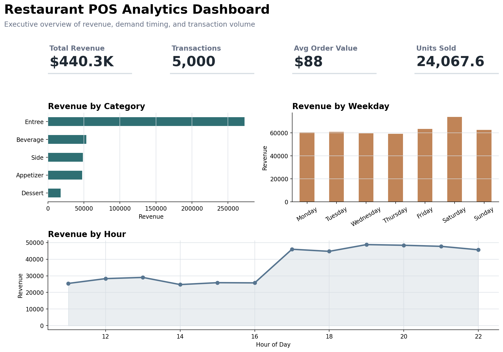

# Restaurant POS Sales Analysis

## Project Overview

This project analyzes simulated point-of-sale transaction data for a steakhouse restaurant. The goal is to identify revenue drivers, understand menu and server performance, uncover sales patterns by day and time, and test whether order-level information can be used to predict high-revenue transactions.

The analysis is designed as a business-facing data analytics project, combining exploratory data analysis, SQL, Power BI preparation, interactive dashboarding, machine learning evaluation, and actionable recommendations for restaurant management.

## Dashboard Screenshots

### Executive Overview



### Menu and Operations


### Model Evaluation


## Business Questions

This project investigates the following questions:

- Which menu categories and items generate the most revenue?
- Which days and hours produce the strongest sales?
- How does server performance compare across revenue and order volume?
- Are certain order types or payment methods associated with higher revenue?
- Can transaction details help predict whether an order will be high revenue?

## Dataset

The dataset contains 5,000 simulated restaurant POS transactions from 2024.

Each row represents one transaction line item and includes:

- Date and time of transaction
- Menu item and category
- Quantity ordered
- Price per item
- Total revenue
- Payment method
- Order type
- Server ID and server name

Dataset file:

```text
Data/steakhouse_pos_simulated_data.csv
```

## Tools Used

- Python
- pandas
- matplotlib
- scikit-learn
- Jupyter Notebook
- Streamlit
- Plotly
- Power BI
- SQL

## Methodology

The project is organized so that reusable logic is separated from the notebook:

- `src/data_cleaning.py` loads the POS data, validates required columns, standardizes data types, and removes duplicate rows.
- `src/feature_engineering.py` creates calendar, hourly, weekend, and high-revenue target features.
- `src/model.py` builds and evaluates the machine learning pipeline.
- `notebooks/eda.ipynb` uses those modules to run the analysis and present business insights.
- `app.py` turns the analysis into an interactive Streamlit dashboard for business exploration.
- `scripts/export_powerbi_data.py` exports a cleaned, feature-enriched dataset for Power BI.
- `scripts/run_sql_analysis.py` runs SQL queries against the prepared dataset and exports result tables.
- `scripts/create_readme_screenshots.py` generates dashboard screenshots for the README.
- `powerbi/` contains Power BI report instructions, suggested DAX measures, and the export-ready CSV.
- `sql/` contains reusable SQL queries and exported SQL result tables.

## Key Findings

### 1. Entrees are the main revenue driver

Entrees generated **$272,974.90**, representing approximately **62.0%** of total revenue. This makes entree sales the strongest contributor to overall restaurant performance.

### 2. Desserts are underperforming

Desserts generated only **$17,739.00**, or about **4.0%** of total revenue. This suggests a potential opportunity to increase average order value through dessert upselling, bundled offers, or server prompts.

### 3. The top steak items drive over half of revenue

New York Strip, Filet Mignon, and Ribeye Steak generated a combined **$228,576.70**, accounting for approximately **51.9%** of total revenue. These premium items are the restaurant's core sales drivers.

### 4. Saturday has the strongest average daily revenue

Saturday produced the highest average daily revenue at approximately **$1,421.85** per day. This was about **25% higher** than Thursday, the weakest day by average daily revenue.

### 5. Dinner hours outperform lunch hours

The strongest revenue hours were **7 PM, 8 PM, and 9 PM**, each generating roughly **$47,000-$49,000** in total revenue. Average order value during these peak dinner hours was approximately **$112**, compared with about **$66-$67** during early afternoon hours.

### 6. Server revenue is balanced, with Nina leading

Nina generated the highest total revenue at **$91,506.80**, representing approximately **20.8%** of total revenue. Overall server performance was relatively balanced, with the gap between the highest and lowest revenue-generating servers at about **$7,941.70**.

## Machine Learning Component

Several classification models were compared to predict whether a transaction would be classified as high revenue, where high revenue is defined as revenue above the dataset median.

Features used included:

- Menu item
- Category
- Payment method
- Order type
- Server name
- Weekday
- Hour
- Month
- Weekend indicator

Model evaluation includes a Dummy baseline, Logistic Regression baseline, and Random Forest model. The Random Forest performed best on the holdout set:

| Model | Accuracy | F1 | ROC-AUC | CV F1 | CV ROC-AUC |
| --- | ---: | ---: | ---: | ---: | ---: |
| Random Forest | 0.792 | 0.786 | 0.889 | 0.775 | 0.880 |
| Logistic Regression | 0.773 | 0.763 | 0.881 | 0.768 | 0.874 |
| Dummy Baseline | 0.501 | 0.000 | 0.500 | 0.000 | 0.500 |

The dashboard also includes a confusion matrix, classification report, feature importance chart, and cross-validation results.

This model should be interpreted as a decision-support experiment rather than a production forecasting system. Since the target is derived from transaction revenue and revenue is strongly influenced by menu item, price, and quantity, the model is most useful for understanding patterns associated with higher-value orders.

## SQL Analysis

The project includes a small SQL analysis component using SQLite. Queries are stored in:

```text
sql/restaurant_analysis.sql
```

The SQL analysis answers questions such as:

- Which menu categories generate the most revenue?
- Which menu items are the top revenue drivers?
- Which weekdays and hours perform best?
- Which servers generate the most revenue?
- Which servers have the highest dessert revenue share?

SQL outputs are exported to:

```text
sql/results/
```

## Business Recommendations

- Prioritize premium entree promotion, especially steak items that account for the majority of revenue.
- Introduce dessert upselling strategies to improve performance in the lowest-revenue category.
- Staff peak dinner hours carefully, especially between 7 PM and 9 PM.
- Use Saturday demand patterns to guide inventory planning and scheduling.
- Study top-performing server behavior to identify successful upselling or service patterns.
- Use predictive modeling as a supporting tool for identifying high-value order patterns, not as the sole basis for staffing or performance decisions.

## Project Structure

```text
RestaurantAnalytics/
├── .streamlit/
│   └── config.toml
├── .gitignore
├── app.py
├── Data/
│   └── steakhouse_pos_simulated_data.csv
├── docs/
│   └── screenshots/
│       ├── dashboard-menu-operations.png
│       ├── dashboard-model-evaluation.png
│       └── dashboard-overview.png
├── notebooks/
│   └── eda.ipynb
├── powerbi/
│   ├── README.md
│   ├── dax_measures.md
│   └── data/
│       └── restaurant_pos_powerbi.csv
├── scripts/
│   ├── create_readme_screenshots.py
│   ├── export_powerbi_data.py
│   └── run_sql_analysis.py
├── sql/
│   ├── README.md
│   ├── restaurant_analysis.sql
│   └── results/
├── src/
│   ├── __init__.py
│   ├── data_cleaning.py
│   ├── feature_engineering.py
│   └── model.py
├── README.md
└── requirements.txt
```

## How to Run

Clone the repository and install the required Python packages:

```bash
pip install -r requirements.txt
```

Open the notebook:

```bash
jupyter notebook notebooks/eda.ipynb
```

Run the notebook cells from top to bottom to reproduce the exploratory analysis, visualizations, and machine learning model.

To launch the interactive dashboard:

```bash
streamlit run app.py
```

The dashboard includes KPI cards, filters, category and menu item analysis, weekday and hourly revenue trends, server performance, order type analysis, model comparison, confusion matrix, feature importance, and business recommendations.

To run the SQL analysis:

```bash
python scripts/run_sql_analysis.py
```

To refresh the Power BI-ready CSV:

```bash
python scripts/export_powerbi_data.py
```

Then import this file into Power BI:

```text
powerbi/data/restaurant_pos_powerbi.csv
```

Power BI report setup instructions and DAX measures are available in the `powerbi/` folder.

To regenerate README screenshots:

```bash
python scripts/create_readme_screenshots.py
```

## Deployment

The Streamlit dashboard is ready to deploy from GitHub using `app.py` as the main file and `requirements.txt` for dependencies.

Recommended Streamlit Community Cloud settings:

```text
Repository: antoguarr/RestaurantAnalytics
Branch: main
Main file path: app.py
```

After deployment, add the live dashboard link near the top of this README.

## Suggested GitHub Metadata

Recommended repository description:

```text
Interactive restaurant POS analytics project with Python, SQL, Streamlit, Power BI preparation, and machine learning model evaluation.
```

Recommended topics:

```text
python, pandas, streamlit, plotly, scikit-learn, sql, sqlite, powerbi, data-analysis, dashboard, machine-learning, restaurant-analytics
```

## Limitations

- The dataset is sourced from Kaggle and appears to be simulated or highly curated, so the findings should not be interpreted as conclusions about a real restaurant.
- The data is already clean, so the project focuses more on validation, analysis, dashboarding, and modeling than complex data cleaning.
- The high-revenue prediction target is created from the transaction revenue median. This is useful for classification practice, but it is not the same as forecasting future demand or profit.
- Revenue is heavily influenced by menu item and price, so the model may learn pricing/category patterns more than deeper customer behavior.
- The dataset does not include important business context such as food cost, margins, table size, customer history, promotions, reservations, weather, or labor costs.

## Future Improvements

- Add a live Streamlit deployment link after publishing the app.
- Build and save the final Power BI `.pbix` file after importing the prepared dataset.
- Add margin or cost data if available to analyze profitability, not only revenue.

## Summary

This project demonstrates the use of Python, SQL, and business intelligence tools to translate restaurant transaction data into business insights. It combines revenue analysis, menu performance evaluation, server comparison, time-based sales trends, interactive dashboards, Power BI reporting preparation, and machine learning model evaluation to support operational decision-making.
